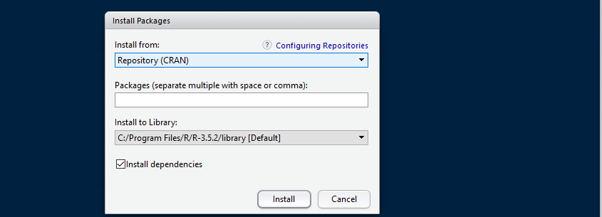

<p align="center">
As you may have already noticed by visiting GESIS and the UKDA, data comes in many different formats, some examples are comma-separated values files (.csv), SPSS files (.spss), STATA files (.dta), excel files (.xls). In RStudio you may upload all datasets mentioned above, but R's native file format is .RData. To load an RData file you should use a function called `load()`. 


```{r load data, include=FALSE}
load("EVS_UK.RData")
```

In SurreyLearn you will find the codebook and the questionnaire of the dataset. Codebooks provide a detailed description of the dataset, such as the name and the code for each variable. 

To upload a dataset that is not stored in R's native file format we will need to install an additional package. 
R packages are like apps, we install them in order to use additional features available in R. To load packages that are foreign to R's native language we should use a package called `haven()`. To do so we use the function called `install.packages()`. In the brackets we include the name of the package we would like to install in quotation marks(" ").  

To do so we type: `install.packages("haven")`

Once the package is installed we may ask RStudio to use it by calling the function `library()`. For example, in order to use the haven package we type `library(haven)`. 

```{r}
library(haven)
```

Alternatively, you may install any package you need by clicking on the Packages tab in the bottom right pane and then click install. A dialog box will appear. In the install Packages dialog write the name of the package you want to install and click install. This will install the package you are looking for.




</p>