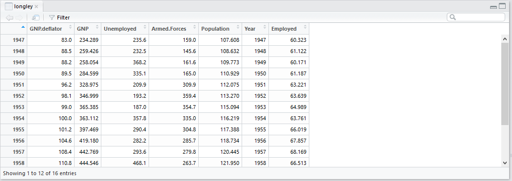

In RStudio a data frame is again an object, but this time an object that stores data. Is similar to a spreadsheet. As in all statistical software variables are kept in columns and observations are in rows.

You may create a data frame manually if you want but living in the age of big data this is rarely the case! There are many example datasets pre-loaded in RStudio

Let's have a look at one of these pre-loaded data frames. The data frame is called longley

Let's see the variables included in the dataset

```{r datalongley, message=FALSE, warning=FALSE, paged.print=FALSE}
data("longley")
```

```{r viewlongley, message=FALSE, warning=FALSE, paged.print=FALSE}
View(longley)
```



If we want to see individuals columns, in other words, a specific variable in the data frame, then we use the $ sign. Let's start by observing the Unemployment column.

```{r longleyvariable, message=FALSE, warning=FALSE, paged.print=FALSE}
longley$Unemployed
```

In addition, often we want to access only certain observations (rows) or only certain variables (columns). By using the square brackets [ ] we subset the data frame. In the square brackets, we insert the coordinates for a row and a column. The row is always first followed by the column. For example, longey[7, 5] gives us the 7th row and the 5th column. If we leave the column coordinate empty then we want to see all columns longey[7, ]. If we leave the row coordinate empty then we want all columns.

```{r longleyrows, message=FALSE, warning=FALSE, paged.print=FALSE}
longley[7,5]
```

Leave the column coordinate empty to see the 7th row

```{r longleyrows2, message=FALSE, warning=FALSE, paged.print=FALSE}
longley[7, ]
```

Leave the row empty to see the 5th column

```{r longleycolumns, message=FALSE, warning=FALSE, paged.print=FALSE}
longley[ ,5]
```

We may see the first ten rows of a dataset by adding a colon in the brackets

```{r longleyrows3, message=FALSE, warning=FALSE, paged.print=FALSE}
longley[1:10, ]
```


# Plots

Let's create a plot from our dataset. Let's start by creating a scatterplot with the one axis (X) representing the Year and the other (Y)axis the Gross National Product

```{r longleyplots}
plot(longley$Year,longley$GNP)
```

to create the same plot but by using a line instead of dots we add the argument `type="l"`


```{r longleyplotsline, message=FALSE, warning=FALSE, paged.print=FALSE}
plot(longley$Year,longley$GNP,type = "l")
```


{} Use the `title()` function, to give labels to the axes, and a title to your plot. 
The examples in the help are particularly informative.
{}
